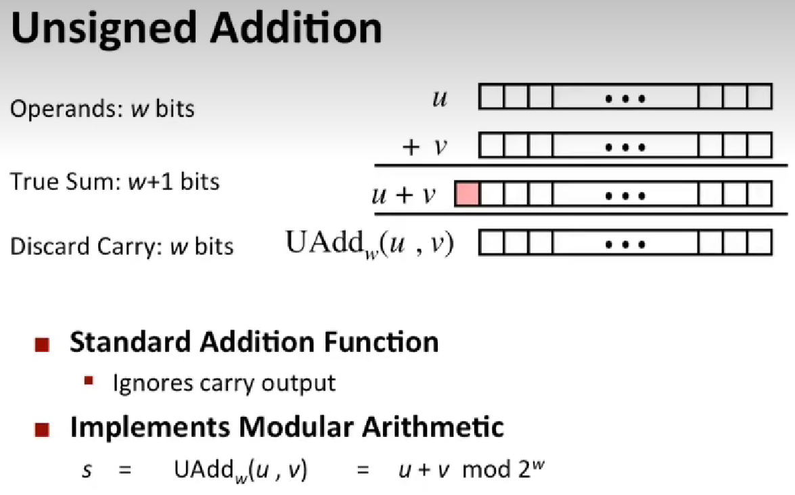
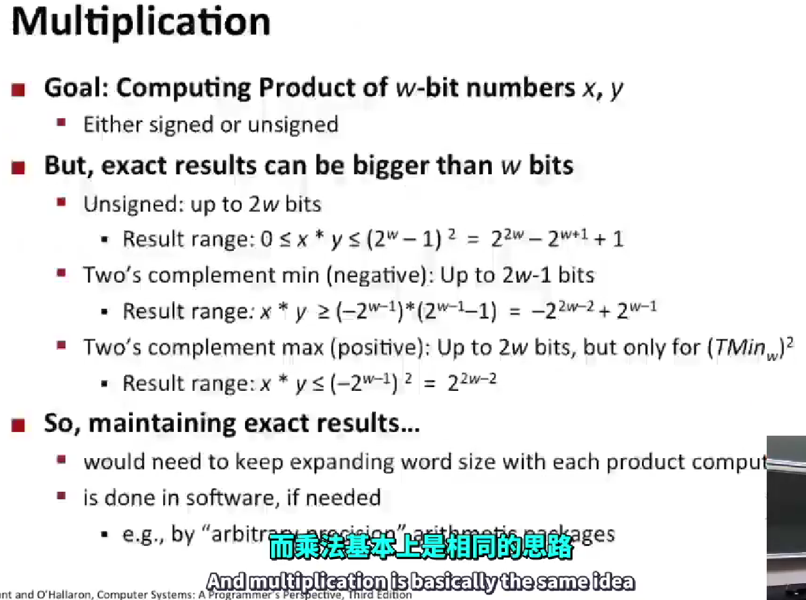

# computing-system -- all in one book
# CSAPP 深入理解计算机系统 [链接](https://www.bilibili.com/video/BV1iW411d7hd/?p=2&vd_source=4eb88a68660d9a539bdb3f1863abf963)  
# 2023南大操作系统课 前置课程  
## Lec02
### 1.移位

#### 1.1 向左移动，不需要管什么数字，只需要管位移，高位消失，低位填0  
#### 1.2 
$$向右移动=
\begin{cases}
逻辑右移& \text{无符号数：高位移动相应的位置，然后用0填充；}\\
算术右移& \text{有符号数：填充取决于首位是0或1：首位为0填充0，首位为1填充 }
\end{cases}$$  
 
### 2.二进制原码和二进制补码的转十进制
* 补码：原码除符号位翻转，末位+1

### 3.数的范围
 

### 4.Values for different word sizes
* UMax = 最大的无符号数字
* TMax = 补码的最大值
* TMin = 补码的最小值
 

### 5.Unsigned and signed numeric values
 

### 6.Conversion Visualized
 

### 7.Casting Surprises
 

## Lec03
### 1.Addition 加法
 

### 2.Multiplication 乘法
#### 2.1 乘法与加法基本上是相同的思路。如果你无法在给定的字长中表示它，则只需要使用较低的w位。
#### 2.2 所有这些复杂的公式只是想说明，如果你取两个w位的数并将它们相乘，你可能需要一个2w位的数来保存结果，但我们只是将其截断为w位。
 
#### 2.3 
$$相乘
\begin{cases}
无符号数& \text{只取低位，相当于模运算。5*5 = 25 = 0001 1001 = 只取低位 1001 = 9 -> 相当于模运算 25%16 = 9}\\
有符号数& \text{1.不仅要抛弃所有的高位；  2.而且无论在这个位置留下什么，都将决定它是正的还是负的；  3.完全不需要考虑原始两个操作符的符号； }
\end{cases}$$  

