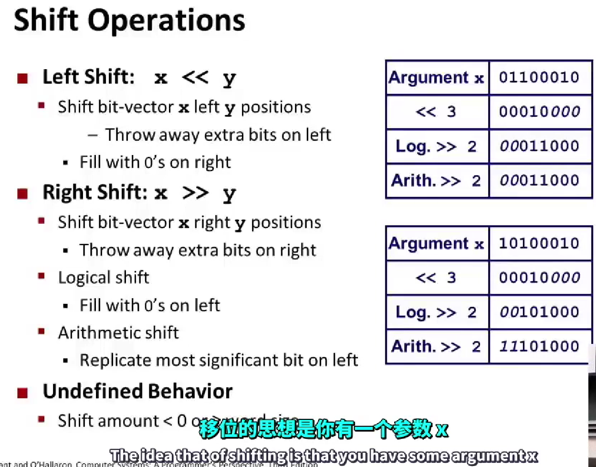
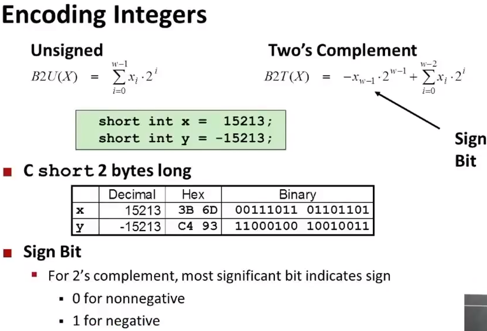
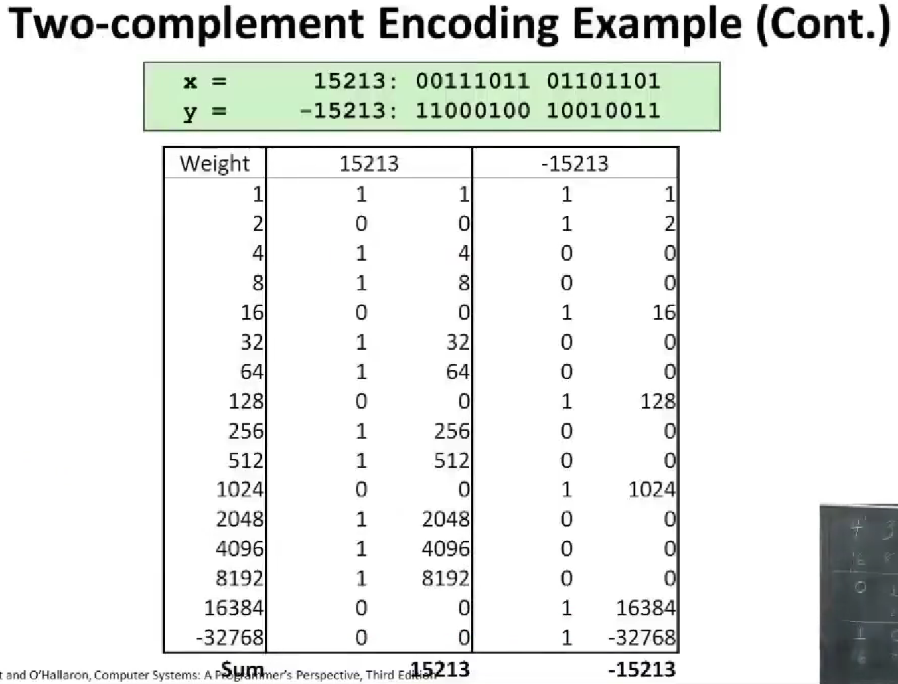
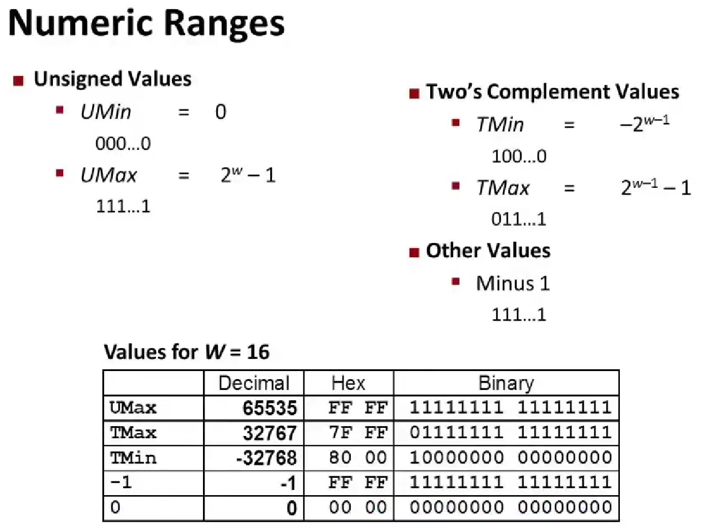
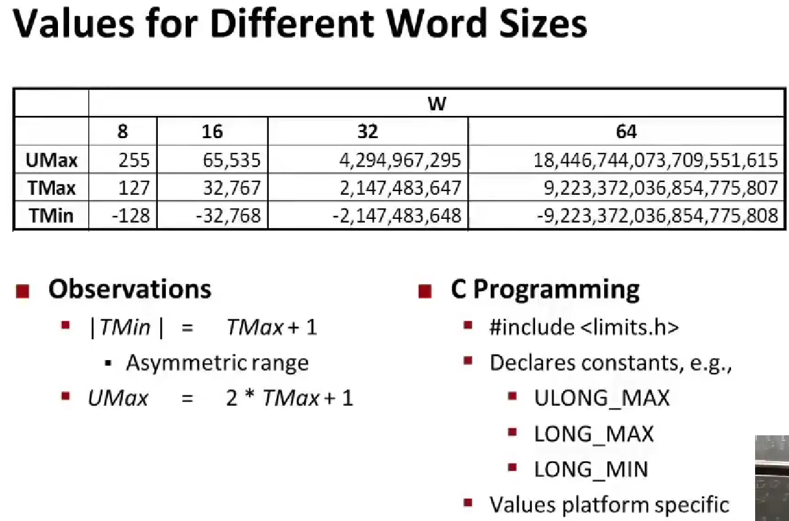
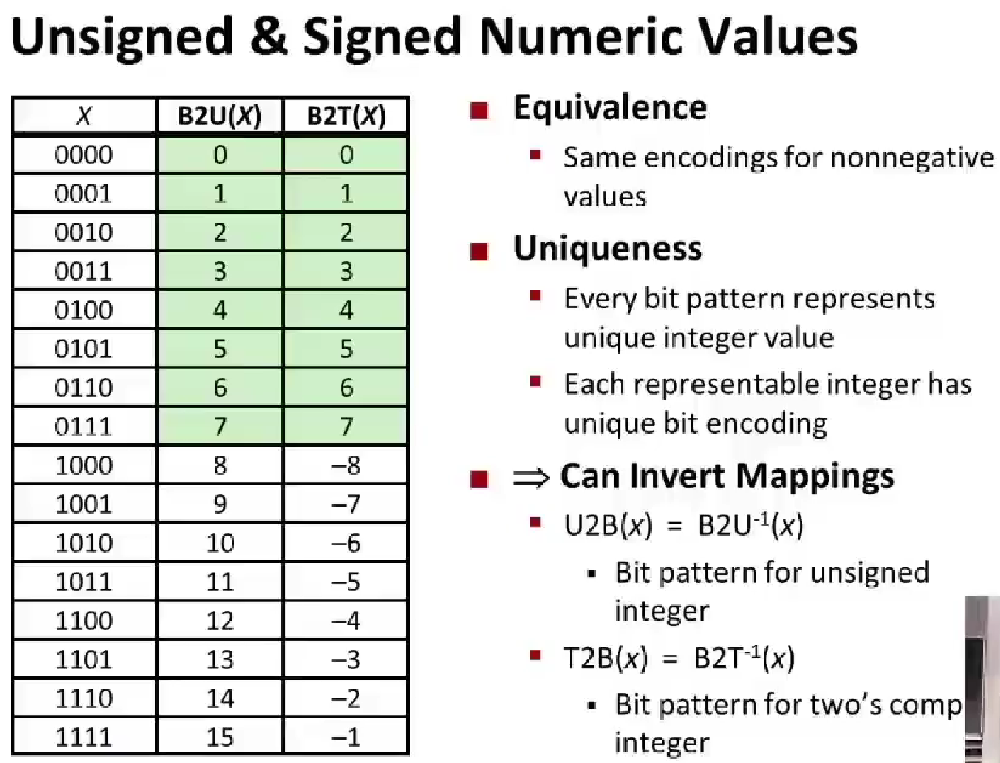
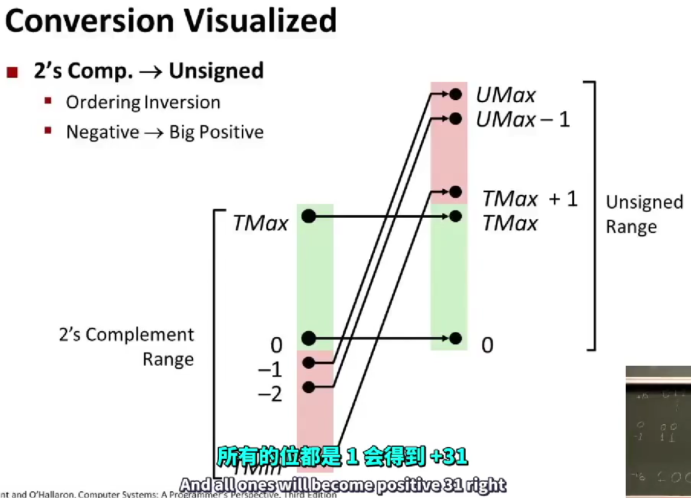
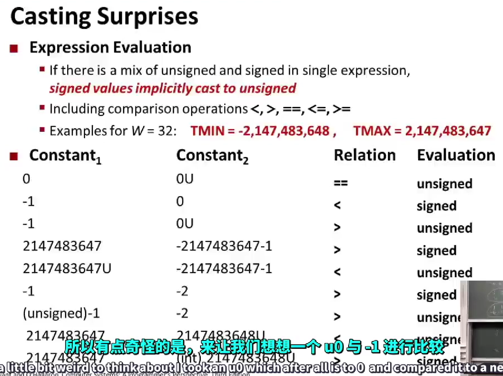

# computing-system-allinone
# 2023南大操作系统课 前置课程 [链接](https://www.bilibili.com/video/BV1iW411d7hd/?p=2&vd_source=4eb88a68660d9a539bdb3f1863abf963)  
## Lec02
### 1.移位

#### 1.1 向左移动，不需要管什么数字，只需要管位移，高位消失，低位填0  
#### 1.2 
$$向右移动=
\begin{cases}
逻辑右移& \text{无符号数：高位移动相应的位置，然后用0填充；}\\
算术右移& \text{有符号数：填充取决于首位是0或1：首位为0填充0，首位为1填充 }
\end{cases}$$  
 
### 2.二进制原码和二进制补码的转十进制
* 补码：原码除符号位翻转，末位+1

### 3.数的范围
 

### 4.Values for different word sizes
* UMax = 最大的无符号数字
* TMax = 补码的最大值
* TMin = 补码的最小值
 

### 5.Unsigned and signed numeric values
 

### 6.Conversion Visualized
 

### 7.Casting Surprises
 

## Lec03

